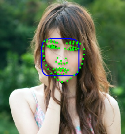
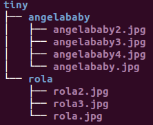

Landmark++
===========

A simple matlab tool for face and landmark detection using Face++'s API.

Usage
-----
###Clone repository

    git clone https://github.com/t0nyren/landmarkpp.git

###A single image

Landmark++ can be used to detect face and 83 facial landmarks of a single image.

    cd matlab
    matlab
    >> singleLandmark('../data/tiny/rola/rola.jpg','show')
    
With the second argument as 'show', the face bounding box and 83 landmarks are shown in the figure.

Alternatively, without showing the the bounding box and landmarks, their positions can be exported to a txt file, which is specified by the second argument of the function,

    >> singleLandmark('../data/tiny/rola/rola.jpg','../data/rola.txt')

###Batch process of a dataset

The tool can also be used to batch detect all faces and landmarks of a full dataset. For example the "tiny" dataset has the directory structure as follows:

Running the function below will traverse "../data/tiny" directory, and then output all faces and their landmarks to a single file "faces.txt".

    >> batchLandmark('../data/tiny', '../data/faces.txt')
    
